# Bloom Ideas Dapp: Project Overview

## Functionality & Main Flows

Bloom Ideas is a Web3 hackathon platform where users can:
- **Browse innovative ideas** (Home Page)
- **Submit new ideas** (Submit Page)
- **View detailed idea pages** (Idea Detail Page)
- **View user profiles** (Profile Page)
- **Manage their own profile** (My Profile Page)
- **Connect/disconnect wallets** (UniversalWalletConnection)
- **Explore garden-themed UI/UX** (Garden Elements, Weather, etc.)

## Blockchain Integration

### Etherlink Testnet Support
The application is configured to work with **Etherlink Testnet** as the primary blockchain network:

- **Chain ID**: 128123 (0x1f47b)
- **Currency**: XTZ (Tezos)
- **RPC URL**: https://rpc.ankr.com/etherlink_testnet
- **Block Explorer**: https://testnet-explorer.etherlink.com

#### Network Configuration
- **Primary Network**: Etherlink Testnet is set as the default network
- **Fallback Networks**: Ethereum Mainnet, Sepolia, and Polygon are available as alternatives
- **Network Switching**: Users can switch between networks using the wallet connection interface
- **Network Addition**: If Etherlink Testnet is not in the user's wallet, a modal helps them add it

#### Wallet Connection Features
- **Automatic Network Detection**: Detects if user is on the correct network
- **Network Switch Prompt**: Shows a prominent button to switch to Etherlink Testnet if on wrong network
- **Network Addition Modal**: Helps users add Etherlink Testnet to their wallet if not configured
- **Balance Display**: Shows XTZ balance instead of ETH when on Etherlink Testnet
- **Explorer Links**: Links to Etherlink Testnet explorer for transaction/address viewing

### Main Pages & Their Roles
- **Home Page (`app/page.tsx`)**: Central hub for browsing/filtering/searching ideas, wallet connection, and navigation.
- **Idea Detail Page (`app/idea/[id]/page.tsx`)**: Shows full details, comments, and status of a selected idea.
- **Submit Idea Page (`app/submit/page.tsx`)**: Form for submitting new ideas, including tags, tech stack, and mockups.
- **Profile Page (`app/profile/[address]/page.tsx`)**: Public profile for any user, showing stats, NFTs, and activity.
- **My Profile Page (`app/profile/me/page.tsx`)**: Editable profile for the logged-in user, with settings.

### Key Components
- **UniversalWalletConnection**: Handles wallet connect/disconnect logic with Etherlink Testnet support.
- **NetworkAdditionModal**: Helps users add Etherlink Testnet to their wallet.
- **GardenExplorer**: Shows wallet-related garden stats when connected.
- **ProfilePopup**: Modal for quick profile viewing.
- **EnhancedIdeaModal**: Modal for detailed idea preview from the home page.
- **SimplifiedIdeaCard**: Card view for each idea in the grid.
- **Garden Elements**: Visual/animated elements for immersive UI.
- **UI Components**: Button, Input, Card, Badge, Avatar, Tabs, Progress, Label, Checkbox, Textarea, etc.

## File/Component Connections

```mermaid
flowchart TD
  HomePage["Home Page (app/page.tsx)"]
  IdeaDetail["Idea Detail Page (app/idea/[id]/page.tsx)"]
  SubmitIdea["Submit Idea Page (app/submit/page.tsx)"]
  Profile["Profile Page (app/profile/[address]/page.tsx)"]
  MyProfile["My Profile Page (app/profile/me/page.tsx)"]
  
  HomePage -->|"View Idea"| IdeaDetail
  HomePage -->|"Submit Idea"| SubmitIdea
  HomePage -->|"View Profile"| Profile
  HomePage -->|"View My Profile"| MyProfile
  
  HomePage --> UniversalWalletConnection["UniversalWalletConnection"]
  UniversalWalletConnection --> NetworkAdditionModal["NetworkAdditionModal"]
  HomePage --> GardenExplorer["GardenExplorer"]
  HomePage --> ProfilePopup["ProfilePopup"]
  HomePage --> EnhancedIdeaModal["EnhancedIdeaModal"]
  HomePage --> SimplifiedIdeaCard["SimplifiedIdeaCard"]
  HomePage --> GardenElements["Garden Elements"]
  
  IdeaDetail --> ProfilePopup
  Profile --> ProfileTabs["Tabs, Stats, NFT Garden"]
  MyProfile --> MyProfileTabs["Tabs, Stats, NFT Garden, Settings"]
  SubmitIdea --> SubmitForm["Idea Submission Form"]
  
  subgraph UI_Components
    Button
    Input
    Card
    Badge
    Avatar
    Tabs
    Progress
    Label
    Checkbox
    Textarea
  end
  HomePage --> Button
  HomePage --> Input
  HomePage --> Card
  HomePage --> Badge
  HomePage --> Avatar
  HomePage --> Tabs
  HomePage --> Progress
  HomePage --> Label
  HomePage --> Checkbox
  HomePage --> Textarea
  IdeaDetail --> Button
  IdeaDetail --> Card
  IdeaDetail --> Badge
  IdeaDetail --> Avatar
  IdeaDetail --> Progress
  IdeaDetail --> Tabs
  Profile --> Card
  Profile --> Badge
  Profile --> Avatar
  Profile --> Tabs
  Profile --> Progress
  MyProfile --> Card
  MyProfile --> Badge
  MyProfile --> Avatar
  MyProfile --> Tabs
  MyProfile --> Progress
  SubmitIdea --> Button
  SubmitIdea --> Input
  SubmitIdea --> Card
  SubmitIdea --> Label
  SubmitIdea --> Checkbox
  SubmitIdea --> Textarea
```

## Suggestions for Improvement

1. **Centralize Mock Data**: Move all mock data (ideas, profiles) to a single file or context for easier management and future backend integration.
2. **Type Safety**: Define and use TypeScript interfaces/types for all idea, profile, and comment objects across the app.
3. **API Integration**: Prepare for backend integration by abstracting data fetching and submission logic into hooks or services.
4. **Component Reuse**: Consider extracting repeated UI patterns (e.g., card layouts, profile stats) into smaller reusable components.
5. **Accessibility**: Audit for accessibility (ARIA labels, keyboard navigation, color contrast).
6. **Testing**: Add unit and integration tests for main flows and components.
7. **Performance**: Lazy-load modals and heavy components, optimize images, and use React.memo where appropriate.
8. **Error Handling**: Add user feedback for failed actions (e.g., wallet connection, form submission).
9. **State Management**: If the app grows, consider using a state management library (Zustand, Redux, or React Context) for global state.
10. **Mobile Responsiveness**: Ensure all pages/components are fully responsive and touch-friendly.
11. **Blockchain Integration**: Consider adding support for additional networks and improving the network switching UX.

---

This overview should help new contributors and maintainers quickly understand the structure, flow, and improvement areas of the Bloom Ideas Dapp. 